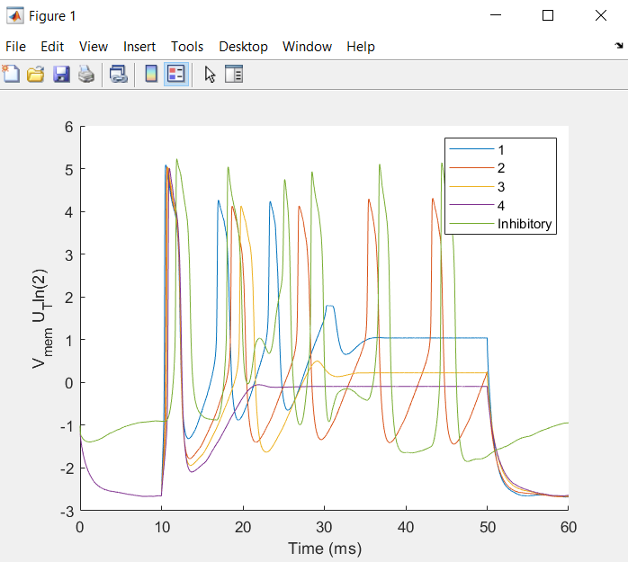

# Running WTA
Compile the C file using: gcc WTA_5neur_fixed.c -o WTA -lm
Run the C file using: ./WTA   ->  This will generate WTA.txt (membrane voltages of each neuron)
Run the Matlab plotting script (Plot_WTA.m) to read-in and plot the output.

# For Newbies
Possible difficulties to look out for:
--Make sure you're actually running these commands in your distribution. I know it sounds obvious but maybe you're stuck in the command prompt and nothing is working and you should actually be in your distribution.
--Make sure your directory is set correctly before compiling! I cannot stress this enough. It will not compile if your directory is not set properly.
    1 - Make sure you are set to the right user which has access to the WTA_5neur file. Use this command in your distribution: cd 'user'
    2 - Find where the WTA_5neur file is located on your computer...could be downloads --> maybe you want to move it to the desktop or elsewhere
    Use this command to set the directory to this location: cd 'location'
    3 - Make sure to set the directory to the WTA_5neur file. 
    Use this command: cd 'WTA_5neur'
    4 - Now you are set to follow the above directions 'Running WTA' to compile the code and then run it. Make sure a text file titled WTA is actually output into the same folder directory. 
--Make sure when you run the Matlab plotting script (Plot_WTA.m) the output looks like the below output.

()