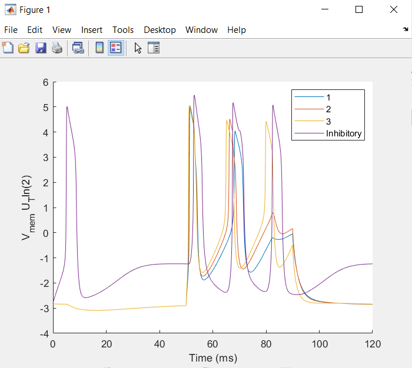

# Running WTA
Compile the C file using: gcc WTA_5neur_float.c -o WTA -lm
Run the C file using: ./WTA   ->  This will generate WTA.txt (membrane voltages of each neuron)
Run the Matlab plotting script (Plot_WTA.m) to read-in and plot the output.
()