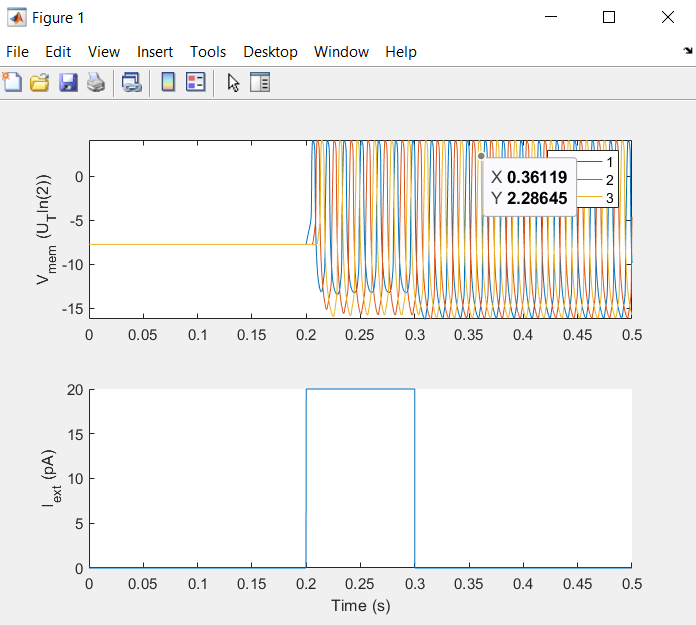
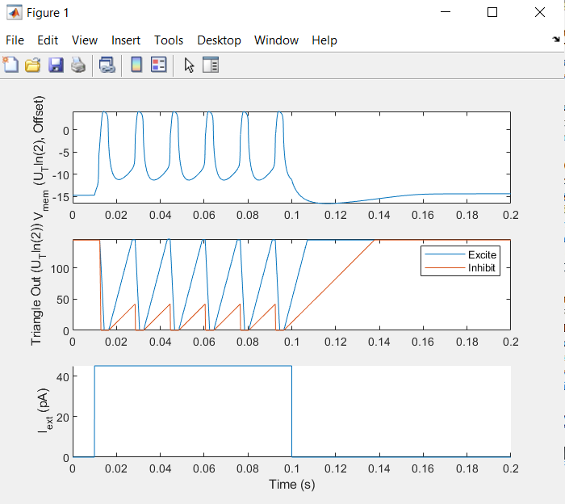

## Requirements
Make sure you have version R2023b Matlab installed.

## Possible Errors
If the code runs but the output does not resemble the imbedded output images:
    -Make sure the variables are calculated correctly and there are no small typos(typos should not be present to start). Check the calculations for variables in other scripts to ensure they match.
    -Ensure the 'Params.NeuronPopulation' parameter is properly set to the amount of neurons for the given code
        -4 for WTA
        -3 for synfire
        -1 for Single Neuron
    
## Params
These are the parameters set for the simulation of the FH neuron to be modified using the SpecifyNeuronsParams script described below.

## SpecifyNeuronParams
Run this in order to change the Parameters of the FH neuron model.
This will allow the tuning of the simulation to be tailored to specific research based off of differing neuron parameters from different biological species.
# Running SpecifyNeuronParams 
Open the MatLab SpecifyNeuronParams script in MatLab.
?
?
?

## WTA
This MatLab code uses a Winner-Take-All system to simulate the Farquhar-Hasler Neuron.
The intention here is to facilitate the creation of FXP models with equivalent FP models.
The FP Model: A fixed-step, explicit Euler ODE solver utilizes approximated Base-2 exponents.
These FP models are then converetd to FXP. 
# Running WTA script
Open the MatLab WTA script in Matlab and run the WTA. 
This will display the output of the 4 inhibitory synapses. 
()

## Synfire_1D
This MatLab code simulates the biological motor pathways formed via interconnected pools of neurons which having a chain-like firing pattern. Specifically, this script simulates a 1D synfire chain.
# Running Synfire_1D script
Open the MatLab synfire script in Matlab and run the synfire. 
This will display the output of the synfire chain as seen below.
()

## Single Neuron
This MatLab code simulates a single FH neuron and synapse response.
# Running Single Neuron script
Open the MatLab SingleNeuronSynapseTest script in MatLab and run this. 
The display should look like the output below for a singular neuron.
()