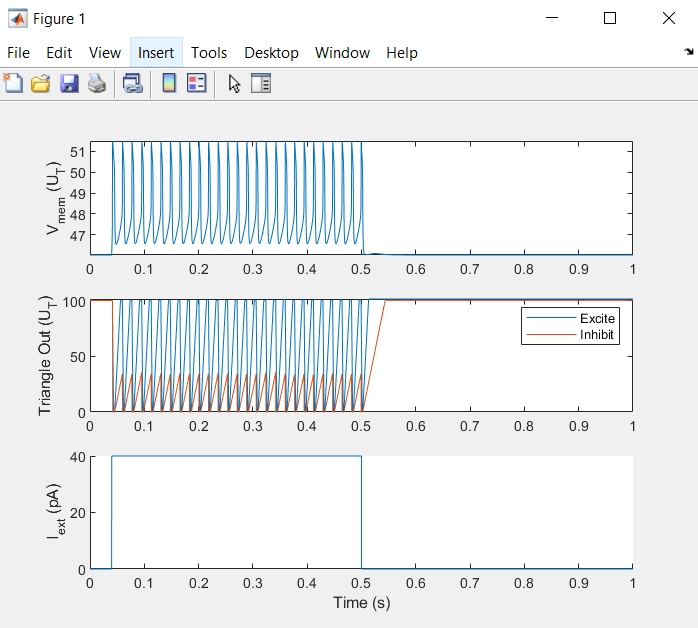

# Requirements
Make sure you have version R2023b Matlab installed.

# Possible Errors
If the code runs but the output does not resemble the imbedded images:
    -Make sure the variables are calculated correctly and there are no small typos(these should not be present to start)
    -Ensure the 'Params.NeuronPopulation' parameter is properly set to the amount of neurons for the given code
        -4 for WTA
        -3 for synfire
        -1 for Single Neuron
The Single Neuron Script may error if you do not have the Optimization Toolbox installed. See below under '## Single Neuron' for more details on this.

## SpecifyNeuronParams
Run this in order to change the Parameters of the FH neuron model.
This will allow the tuning of the simulation to be tailored to specific research based off of differing neuron parameters from different biological species.

## WTA
This MatLab code uses a Winner-Take-All system to simulate the Farquhar-Hasler Neuron.
The intention here is to facilitate the creation of FXP models with equivalent FP models.
The FP Model: A fixed-step, explicit Euler ODE solver utilizes approximated Base-2 exponents
These FP models are then converetd to FXP. 
# Running WTA script
Open the MatLab WTA script in Matlab and run the WTA. 
This will display the output of the 4 inhibitory synapses. 
()

## Synfire
This MatLab code simulates the biological motor pathways formed via interconnected pools of neurons which having a chain-like firing pattern. Hence the name synfire chain. 
# Running Synfire script
Open the MatLab synfire script in Matlab and run the synfire. 
This will display the output of the synfire chain as seen below.
()

## Single Neuron
This MatLab code simulates a single FH neuron response.
--> You will need the Optimization Toolbox by Mathworks to run this script
--> If you do not want to install this toolbox you can run a quick transient sim instead.
# Running Single Neuron script
Open the MatLab SingleNeuronSynapseTest script in MatLab and run this. 
The display should look like the output below for a singular neuron.
There should be two figures displayed. 
    -->One figure shows the change in Current over time for the Excitatory or Inhibitory neuron simulation.
        ()
    -->The other figure displays:
        -Change in membrane voltage over time
        -Change in external membrane current over time
        -Change in spike threshold between the excitatory and inhibitory outputs from the Triangle Generator ODE function
        ()