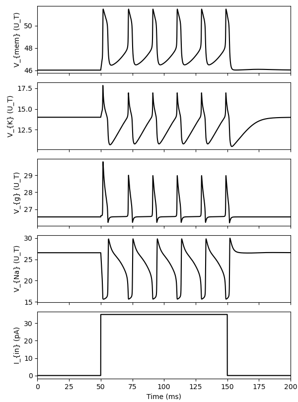
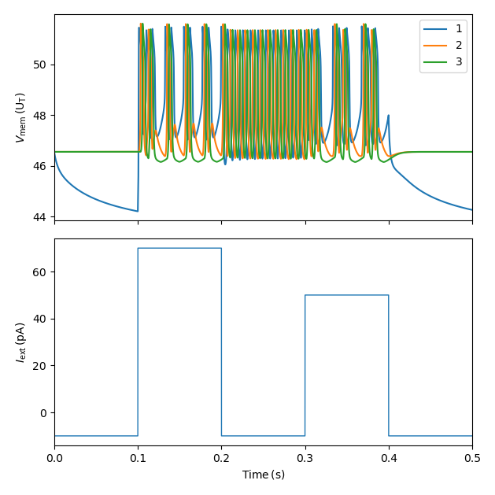
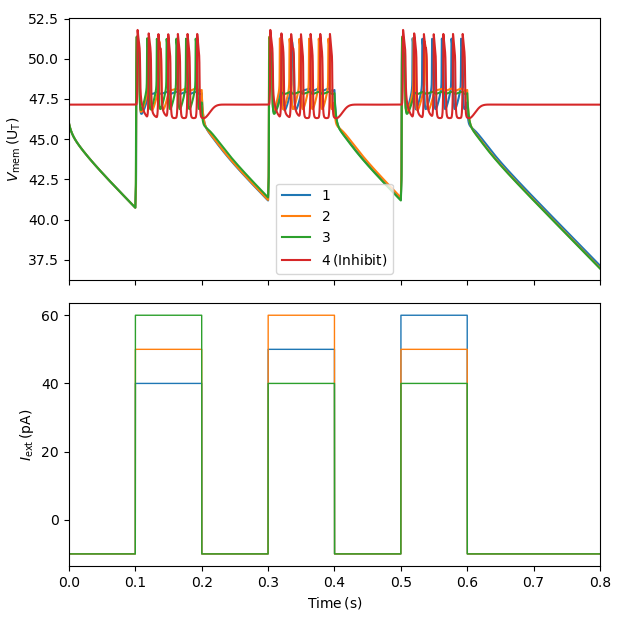

## Requirements
-->Make sure that you are using Python version 3.11.4.
-->Make sure that the necessary libraries are installed.
	These libraries can be installed and then the script, with the proper imports, can be run in Python or any suitable code editor(VSC, Atom, etc.). There are multiple ways to install these libraries:
	-Use Python's direct installation package installer "pip"
		EX: 
		pip install numpy
	-Use Ananconda
		EX: 
		conda install numpy
	-Use virtual environments. Specifically Python's venv module which can be used to create isolated Python environments.
		EX: 
		python -m venv myenv
		source myenv/bin/activate
		pip install numpy
	-There are a variety of other methods that work as well. Feel free to use whichever bets suits your needs.
-->Make sure the imports are working correctly. They need to call the proper functions from their libraries and the proper functions from the other Python files. Many of the functions written in the python files are called within other python files and must be imported first --> Of course, this has already been coded.

## Possible Errors
-->If there are errors with the imports this is likely because you have not installed the libraries. Install!
	Otherwise this would indicate an issue with the importation of a function from another Python script which should not happen unless the code has been changed. The necessary Python scripts that call on functions from one another exist in the same folder in GitHub.
-->If the code runs but the output does not reflect the embedded output images:
	-If you changed the input parameters --> these are located in NeuronModules.py:
		-Make sure the intial conditions(simulation parameters) are also changed to compensate for the change in parameters so the output converges correctly.

## FYI
-->There was difficulty running the WTA and Synfire simulations using an ODE function using the odeint function import from SciPy. Odeint and the standard Python ode solvers reduce step size to aggressively with the network models, leading to convergence issues. To solve this issue a fixed-step euler_solver function was developed as seen in NeuronModules.py.
-->The Python script for a singular FH Type HH Neuron does not use the Euler step function, but rather a simple ODE solver. The odeint function from SciPy was successfully used for this.

## Running the Script
Open the code in Python or whichever code editor your prefer.
Change parameters and intial conditions as needed.
RUN.

## NeuronModules
This code is required to run all the other Python scripts here. 
It contains the functions and parameters imported and called by the OneNeuron, Synfire_1D, and WTA Python scripts.
-->If this code is not in the same file location as the other Python scripts they will not run!
-->If this code is not imported at the top of the other Python scripts before the functions are called the scripts will not run!

## OneNeuron
Using a simple ODE function called Neuron, which is called in NeuronTest, this script simulates a singular FH Type HH neuron and its synapse. This code's output displays the three gating variables (V_k, V_g, V_Na) as the neuron spikes. It also shows the input stimulation current over time (bottom subplot) as well as the membrane voltage change over time (top subplot).

## Synfire 1D
This script simulates response of a FH neuron that is in a 1D Synfire chain. This is similar to the MatLab code which simulates the biological motor pathways which are formed from the interconnected pools of neurons. These neurons have a chain-like firing pattern giving them the name synfire chain. 
The output figure of this Python script is similar to the Base_e Synfire output figure.

## WTA
This code simulates the response of a FH neuron using a Winner-Take_All approach the same as the MatLab WTA for base_e. It should be noted the Python script uses an Eulor step solver function while the MatLab script uses the built in ODE function. This Python WTA code achieves the same output as the MatLab Base_e WTA script.

